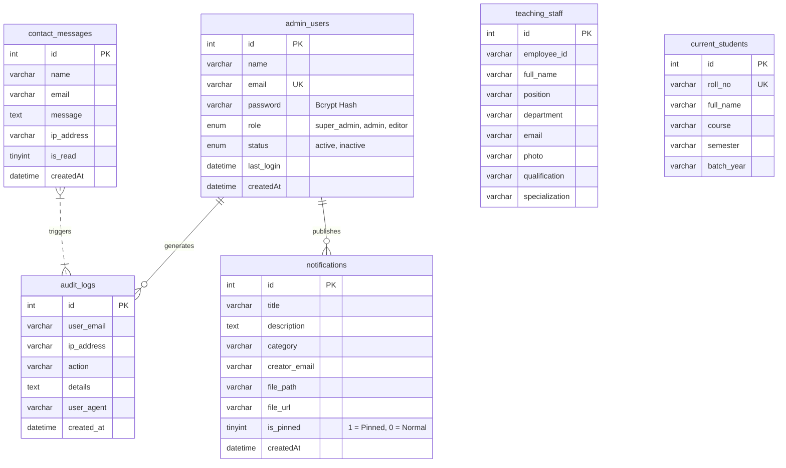

# Centre for Computer Science and Applications (CCSA)
### Dibrugarh University, Assam, India

<div align="center">
  

  <p align="center">
    <strong>Official Web Portal &amp; Academic Management System</strong><br />
    Approved by AICTE | Accredited by NAAC | GIGW 3.0 &amp; UX4G Compliant
  </p>

  <p align="center">
    
    
    
    
    
  </p>
</div>

---

## 📌 Project Overview

This repository contains the full-stack web application for the **Centre for Computer Science and Applications (CCSA)**, Dibrugarh University. The portal serves prospective students, enrolled scholars, faculty members, and institutional visitors by providing real-time academic curricula, live faculty and student directories, official circulars, research profiles, and an administrative control panel.

---

## 🚀 Key Features

- **Academic Program Portals:** In-depth pages for **BCA**, **MCA (AICTE Approved)**, **PGDCA**, and **Ph.D. in Computer Science** featuring course structures, eligibility criteria, and 1-click **Print / Save as PDF** tools.
- **Central University Proxy Integration:** Real-time synchronization with Dibrugarh University's central DigitalOcean backend for live faculty directories and student enrollment feeds.
- **Spotlight Global Search (`Ctrl + K` / `⌘K`):** Instant client-side search engine indexing courses, faculty members, research domains, circulars, and institutional links with browser search history.
- **Notice Board & Urgency Pinning:** Administrative notice board supporting PDF circular uploads, Google Drive links, and **Pin to Top** featured announcements.
- **Anti-Ragging & Grievance Helpline:** Statutory compliance modal providing direct access to the 24x7 National Anti-Ragging Toll-Free Helpline (1800-180-5522) and the DU Proctorial Board.
- **UX4G & GIGW 3.0 Accessibility:** Font resizer (`A- / A / A+`), skip-to-content landmarks, and high-contrast color balancing.
- **Research & Innovation Showcase:** Dedicated hubs for Generative AI, Cloud Security, Machine Learning, and indexed journal publications.

---

## 🏛️ System Architecture & Tech Stack

```
[ Client Browser ]
       │
       ├──> [ Apache / Nginx / PHP 8.1+ Webroot (src/) ]
       │          ├── Vanilla PHP Core & Security Engine (CSRF, Sessions, Rate Limiter)
       │          ├── Tailwind CSS & FontAwesome Icons
       │          └── Local Client-Side Modules (Weather, Spotlight, Search History)
       │
       ├──> [ Local MySQL Database (database.sql) ]
       │          ├── Admin Accounts (Bcrypt Hash)
       │          ├── Notices & Document Registry
       │          ├── Inquiries & Contact Messages
       │          └── Security Audit Logs
       │
       └──> [ DU Central Cloud Proxy ]
                  └──> https://lionfish-app-3a378.ondigitalocean.app/api/...
```

---

## 📂 Repository Structure

```
public_html/
├── src/
│   ├── .htaccess                   # Production security headers, GZIP & cache rules
│   ├── index.php                   # Departmental Homepage & Hero Showcase
│   ├── undergraduate.php           # BCA Programme Details & Syllabus
│   ├── postgraduate.php            # MCA Programme Details & AICTE Approval
│   ├── pgdca.php                   # PGDCA Diploma Details
│   ├── phd.php                     # Ph.D. in Computer Science Research Programme
│   ├── faculty.php                 # Faculty Directory (Proxy-synced)
│   ├── Present_Stu.php             # Current Enrolled Student Roster
│   ├── research.php                # Frontier Research Labs & Collaborations
│   ├── publication.php             # Research Papers & Journal Archives
│   ├── notices.php                 # Official Announcements & Notice Board
│   ├── faculty-proxy.php           # University API Proxy for Faculty
│   ├── student-proxy.php           # University API Proxy for Students
│   ├── robots.txt                  # Search engine crawler directives
│   ├── sitemap.xml                 # XML Sitemap for search indexing
│   ├── database.sql                # Complete MySQL Schema & Seed Data
│   │
│   ├── admin/                      # Secure Administration Suite
│   │   ├── index.php               # Admin Dashboard (Notices, Inquiries, Admins, Logs)
│   │   ├── login.php               # Bcrypt Login with Rate Limiting
│   │   ├── actions.php             # Secure CRUD Action Handler
│   │   ├── config.php              # Database Connection & Environment Config
│   │   ├── check_session.php       # 30-Minute Idle Timeout Guard
│   │   ├── sections/               # Modular Dashboard Views
│   │   └── uploads/                # Isolated PDF Document Storage (.htaccess guarded)
│   │
│   ├── assets/                     # Frontend Assets (CSS, JS, Fonts)
│   │   ├── css/custom.css          # Print media queries & custom animations
│   │   └── js/                     # Modular client-side scripts
│   │
│   ├── includes/                   # Core Security & Session Classes
│   │   ├── Security.php            # CSRF, XSS filter, Safe file validator, Audit logging
│   │   └── Session.php             # Hardened cookie session manager
│   │
│   └── templates/                  # Reusable Header & Footer Components
│       ├── header.php              # Navbar, SEO Meta, Schema.org JSON-LD, Search Button
│       └── footer.php              # Footer Links, Live Weather, Helpline & Search Modals
│
├── README.md                       # Comprehensive Project Documentation
└── INSTRUCTION.md                  # Quick-Start & First-Time Setup Guide
```

---

## 🗄️ Database Schema & Structure

The system uses an **InnoDB** engine with `utf8mb4_unicode_ci` encoding. Below is the structural overview of all tables defined in [`src/database.sql`](src/database.sql):



### Table Breakdown:
1. **`admin_users`**: Manages departmental administrators with strict role-based access control (`super_admin`, `admin`, `editor`).
2. **`notifications`**: Stores circulars, admission bulletins, timetables, and document links with `is_pinned` sorting.
3. **`contact_messages`**: Stores public inquiries submitted via the homepage contact form.
4. **`audit_logs`**: Tracks authentication attempts, logins, notice uploads, and deletions for security compliance.
5. **`teaching_staff`**: Fallback directory for faculty records when proxy is unreachable.
6. **`current_students`**: Fallback directory for student rosters.

---

## 🔒 Security Specifications

- **Password Hashing:** Enforces `PASSWORD_BCRYPT` with cost factor `12`.
- **Brute-Force Protection:** Exponential lockout after 5 consecutive failed attempts.
- **SQL Injection Prevention:** 100% of queries use PDO parameterized prepared statements.
- **CSRF Token Validation:** Cryptographic tokens generated per session and validated on all POST operations.
- **Secure File Upload Pipeline:** Strict MIME-type binary inspection, extension whitelisting (`.pdf`, `.docx`, `.png`), randomized file hashing, and script execution prevention in upload folders.
- **HTTP Security Headers:**
  - `X-Frame-Options: SAMEORIGIN`
  - `X-Content-Type-Options: nosniff`
  - `Referrer-Policy: strict-origin-when-cross-origin`
  - `Permissions-Policy: geolocation=(), microphone=(), camera=()`

---

## ⚡ Quick Start for Developers

For complete step-by-step instructions on running the project locally for the first time, please see **[`INSTRUCTION.md`](INSTRUCTION.md)**.

```bash
# 1. Clone repository
git clone https://github.com/chenkham/ccsa-web-portal.git

# 2. Navigate to project
cd ccsa-web-portal

# 3. Start local development server
php -S localhost:8000 -t src
```

Open [http://localhost:8000](http://localhost:8000) in your browser.

---

## 📜 Institutional Attribution & Contact

- **Institution:** Centre for Computer Science and Applications (CCSA), Dibrugarh University
- **Managed By:** Chenkham
- **Email:** [chenkhamchowlu@gmail.com](mailto:chenkhamchowlu@gmail.com)
- **Technical Support:** Digital Solution Cell, Dibrugarh University
- **Official University Portal:** [https://dibru.ac.in](https://dibru.ac.in)
